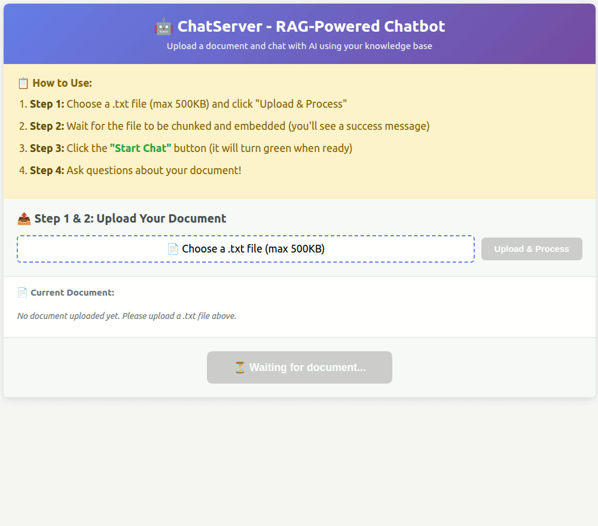

# ChatServer — RAG-Powered Chatbot Backend

Django 5 backend with document ingestion, semantic search (with MMR), LangGraph orchestration, and streaming chat capabilities.



🚀 **Live Demo**: [https://191.101.81.150](https://191.101.81.150)  
💻 **Local Development**: [http://localhost:8000/demo/](http://localhost:8000/demo/)

## Features

- **Document Management**: Upload and process text documents (500KB limit, .txt only)
- **Semantic Search**: SBERT embeddings with cosine similarity
- **MMR (Maximal Marginal Relevance)**: Diverse, relevant retrieval results
- **Session-Based Chat**: Independent sessions with document binding
- **Smart Memory**: Token-bounded history (3000 tokens) + rolling summaries (every 5 turns)
- **LangGraph Orchestration**: Multi-node workflow with intelligent retrieval decisions
- **Real-time Streaming**: Server-Sent Events (SSE) for token-by-token responses
- **PostgreSQL Database**: Production-ready database with session isolation
- **Intelligent Retrieval**: Automatic RAG triggering based on message content

---

## Quick Start

### 1. Prerequisites

**PostgreSQL Database:**
```bash
# Using Docker (recommended)
docker run -d \
  --name qtec-postgres \
  -e POSTGRES_DB=qtec_chatbot \
  -e POSTGRES_USER=qtec_user \
  -e POSTGRES_PASSWORD=qtec_password \
  -p 5433:5432 \
  postgres:15

# Or install locally: https://www.postgresql.org/download/
```

### 2. Installation

```bash
# Install dependencies
pip install -r requirements.txt

# Configure environment variables
echo "OPENAI_API_KEY=your_key_here" > .env

# Run migrations
python manage.py migrate

# Create superuser (optional)
python manage.py createsuperuser
```

### 3. Run Server

```bash
python manage.py runserver
```

Access the demo at: `http://localhost:8000/demo/`

---

## API Endpoints

### Health

**GET `/health/`**  
Health check endpoint. Returns `{"status": "ok"}`.

```bash
curl http://localhost:8000/health/
```

---

### Documents

**POST `/api/documents/upload/`**  
Upload and process a document. Documents are bound to chat sessions for isolation.

```bash
curl -X POST http://localhost:8000/api/documents/upload/ \
  -F "file=@document.txt" \
  -F "auto_process=true" \
  -F "session_id=session-uuid"
```

**Parameters:**
- `file` (required): Text file (.txt only, max 500KB)
- `auto_process` (optional, default: true): Automatically chunk and embed
- `session_id` (optional): Bind document to specific session

**Response:**
```json
{
  "id": "uuid-here",
  "filename": "document.txt",
  "file_size": 1024,
  "chunk_count": 5,
  "auto_processed": true,
  "session_id": "session-uuid",
  "created_at": "2025-10-08T12:00:00Z"
}
```

**Note:** Uploading a new document to an existing session will delete previous documents and chat history for that session.

**GET `/api/documents/`**  
List all documents.

**GET `/api/documents/{id}/`**  
Get a specific document.

**GET `/api/documents/{id}/chunks/`**  
Get all chunks for a document.

---

### Retrieval (Semantic Search)

**POST `/api/retrieve/`**  
Search for relevant document chunks using semantic similarity with optional MMR.

```bash
curl -X POST http://localhost:8000/api/retrieve/ \
  -H "Content-Type: application/json" \
  -d '{
    "query": "machine learning algorithms",
    "top_k": 5,
    "use_mmr": true,
    "lambda_param": 0.5,
    "session_id": "session-uuid"
  }'
```

**Parameters:**
- `query` (required): Search query text
- `top_k` (optional, default: 3): Number of results to return
- `use_mmr` (optional, default: true): Enable MMR for diversity
- `lambda_param` (optional, default: 0.5): MMR trade-off (0=diversity, 1=relevance)
- `session_id` (optional): Filter by specific session

**Response:**
```json
{
  "query": "machine learning",
  "top_k": 3,
  "use_mmr": true,
  "lambda_param": 0.5,
  "results": [
    {
      "score": 0.8532,
      "chunk_id": "chunk-uuid",
      "text": "Machine learning is a subset of AI...",
      "document_id": "doc-uuid",
      "document_filename": "ml-basics.txt",
      "chunk_index": 2
    }
  ]
}
```

---

### Chat Sessions

**GET `/api/sessions/`**  
List all chat sessions.

**POST `/api/sessions/`**  
Create a new chat session.

```bash
curl -X POST http://localhost:8000/api/sessions/ \
  -H "Content-Type: application/json" \
  -d '{"title": "New Conversation"}'
```

**GET `/api/sessions/{id}/`**  
Get a specific session with messages.

---

### Chat (AI Conversation)

**POST `/api/chat/send/`** (Synchronous)  
Send a message and get AI response with RAG.

**POST `/api/chat/stream/`** (Streaming - SSE)  
Send a message and receive AI response via Server-Sent Events. Retrieval is automatically triggered based on message content.

```bash
curl -X POST http://localhost:8000/api/chat/stream/ \
  -H "Content-Type: application/json" \
  -d '{
    "session_id": "session-uuid",
    "message": "What is machine learning?",
    "model": "gpt-4o-mini"
  }'
```

**Parameters:**
- `session_id` (required): Chat session UUID
- `message` (required): User's message/question
- `model` (optional, default: gpt-4o-mini): OpenAI model to use

**Retrieval Triggering:**  
RAG is automatically triggered for questions, long messages (>10 words), document references, or messages ending with "?". Simple greetings like "hi", "hello", "thanks" are excluded.

**Response:**
```json
{
  "session_id": "session-uuid",
  "message_id": "message-uuid",
  "content": "Machine learning is a subset of artificial intelligence...",
  "retrieved_chunks": [
    {
      "text": "ML definition from docs...",
      "score": 0.89,
      "document": "ml_basics.txt",
      "chunk_id": "chunk-uuid"
    }
  ],
  "metadata": {
    "tokens_used": 450,
    "retrieval_count": 3,
    "context_messages": 2,
    "model": "gpt-4o-mini"
  }
}
```

**SSE Response Format:**
```
data: {"type": "delta", "content": "Quantum"}
data: {"type": "delta", "content": " computing"}
data: {"type": "done", "message_id": "msg-uuid", "chunks": 3}
```

Event types: `delta` (text chunk), `done` (completion), `error` (failure)

**Error Responses:** Standard JSON error format with `error` and `code` fields (e.g., `SESSION_NOT_FOUND`, `LLM_AUTH_ERROR`, `RATE_LIMIT_EXCEEDED`).

---

## Configuration

### Environment Variables

Create a `.env` file:

```bash
# Django
SECRET_KEY=your-secret-key
DEBUG=1
ALLOWED_HOSTS=localhost,127.0.0.1

# Database
DB_NAME=qtec_chatbot
DB_USER=qtec_user
DB_PASSWORD=qtec_password
DB_HOST=localhost
DB_PORT=5433

# OpenAI (REQUIRED)
OPENAI_API_KEY=sk-your-api-key-here
OPENAI_MODEL=gpt-4o-mini

# Chat Configuration
CHAT_CONTEXT_MESSAGES=10
CHAT_MAX_TOKENS=2000
CHAT_TEMPERATURE=0.7

# RAG Configuration
RAG_ENABLED=true
RAG_TOP_K=3
RAG_USE_MMR=true

# Memory Configuration
CHAT_MAX_TOKENS_CONTEXT=3000
CHAT_HISTORY_MIN_TURNS=6
SUMMARY_INTERVAL_TURNS=5
```

Get an OpenAI API key from [OpenAI Platform](https://platform.openai.com/api-keys).

### Database

PostgreSQL is configured in `chatserver/settings.py`:
- **Database**: `qtec_chatbot`
- **User**: `qtec_user`
- **Port**: `5433` (Docker) or `5432` (local)
- **Connection pooling**: Enabled with `CONN_MAX_AGE=60`

---

## Management Commands

### Ingest Documents

Process all documents (chunk + embed) in bulk:

```bash
python manage.py ingest_docs
```

Finds all documents without embeddings, chunks the text, generates embeddings using SBERT, and stores them in the database.

---

## Architecture

### System Design

The chatbot uses **LangGraph** to orchestrate a multi-node workflow, ensuring clean separation of concerns and extensibility.

### Core Components

1. **Document Management** (`chat/models.py`)
   - `Document`: Stores raw text with metadata
   - `DocumentChunk`: Text chunks with 384-dim SBERT embeddings
   - Semantic paragraph-based chunking (500 chars max)

2. **Embeddings & Retrieval** (`chat/embedding_utils.py`, `chat/retrieval.py`)
   - Model: `all-MiniLM-L6-v2` (SBERT, 384 dimensions)
   - Similarity: Cosine similarity
   - MMR Algorithm: Maximal Marginal Relevance for diverse results
   - Session filtering: Only retrieves chunks from session-bound documents

3. **Chat Memory** (`chat/langgraph/nodes/load_history.py`)
   - **Short-term**: Token-bounded history (3000 tokens, 6 turn minimum)
   - **Long-term**: Rolling session summaries (updated every 5 assistant turns)
   - Prevents context window overflow while maintaining coherence

4. **LangGraph Orchestration** (`chat/langgraph/`)
   - **Workflow**: `load_history → decide_retrieve → [retrieve?] → synthesize_stream → summarize`
   - **Nodes**: load_history, decide_retrieve, retrieve, synthesize, synthesize_stream, summarize
   - Retrieval decision uses heuristics (question words, message length, document references)

5. **LLM Integration** (`chat/llm.py`)
   - Provider: OpenAI API (gpt-4o-mini default)
   - Features: Synchronous and streaming responses
   - Token counting: tiktoken for accurate estimation

6. **Streaming** (`chat/views.py`, `chat/langgraph/graph.py`)
   - Protocol: Server-Sent Events (SSE)
   - Events: `delta` (deltas), `done` (completion), `error` (failures)

### Design Decisions

- **LangGraph**: Explicit control flow, conditional logic, testable nodes
- **Two-tier Memory**: Balances context window limits, cost optimization, and coherence
- **MMR**: Ensures diverse retrieval results, preventing redundant chunks
- **PostgreSQL**: Handles concurrency, ACID compliance, production-ready
- **SSE**: Simpler than WebSockets for one-way streaming, HTTP-compatible

---

## Tech Stack

- **Framework**: Django 5.0.6
- **API**: Django REST Framework 3.15
- **Database**: PostgreSQL 15 (with connection pooling)
- **Orchestration**: LangGraph
- **LLM Provider**: OpenAI API (gpt-4o-mini)
- **Embeddings**: sentence-transformers (SBERT, all-MiniLM-L6-v2)
- **Token Counting**: tiktoken
- **Streaming**: Server-Sent Events (SSE)
- **Python**: 3.10+

---

## Project Structure

```
chatserver/
├── chat/                    # Main app
│   ├── models.py           # Database models
│   ├── serializers.py      # DRF serializers
│   ├── views.py            # API endpoints
│   ├── urls.py             # URL routing
│   ├── retrieval.py        # Search & MMR
│   ├── embedding_utils.py  # Embedding generation
│   ├── chunking.py         # Text chunking
│   ├── llm.py              # OpenAI integration
│   ├── prompts.py          # Prompt engineering
│   ├── tests.py            # Unit tests
│   ├── langgraph/          # LangGraph orchestration
│   │   ├── graph.py        # Graph definition & execution
│   │   ├── state.py        # Shared state schema
│   │   └── nodes/          # Individual graph nodes
│   │       ├── load_history.py
│   │       ├── decide_retrieve.py
│   │       ├── retrieve.py
│   │       ├── synthesize.py
│   │       ├── synthesize_stream.py
│   │       └── summarize.py
│   └── management/
│       └── commands/
│           └── ingest_docs.py
├── chatserver/             # Project settings
│   ├── settings.py
│   └── urls.py
├── static/
│   └── sse-demo.html       # Streaming demo
├── requirements.txt
├── manage.py
└── README.md
```

---

## Testing

### Run Tests

```bash
# All tests
python manage.py test

# Specific test suites
python manage.py test chat.tests.RetrievalTests
python manage.py test chat.tests.MMRTests
python manage.py test chat.tests.ChunkingTests
```

**Test Coverage:**
- Document chunking
- MMR algorithm (with/without diversity)
- Semantic search (with/without MMR)
- Document filtering
- Edge cases (empty corpus, no embeddings)

---

## License

MIT